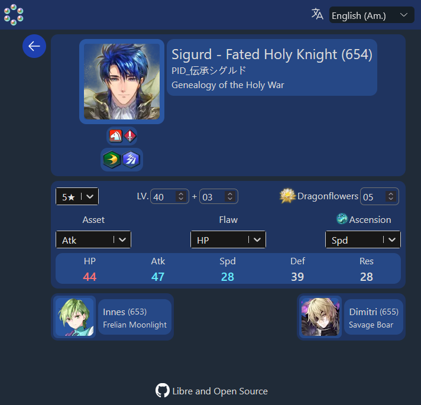
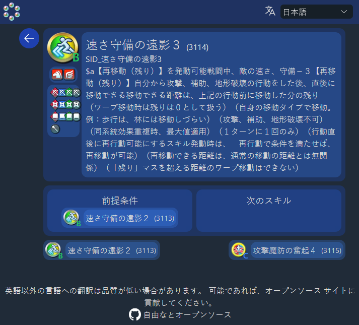

<p align="center">
  
</p>

# fehPI

## Overview
A GraphQL API offering source information from the Fire Emblem Heroes mobile game. Explore Heroes and their Skills with the demonstration [client application](https://feh-pi.vercel.app/) too, with support for all source languages from the game.

`POST` to `https://feh-pi.vercel.app/api/graphql` for the API.

 

## Building

This application is deployed on Vercel and integrated with Vercel's KV Redis storage - yes, even when running locally. Please see [fehPi-bootstrapper](https://github.com/MrCocoNuat/fehPI-bootstrapper) for initialization of the source data - there is a lot of it, so if you are cheap and use the free Hobby plan from Vercel like me, you will need these tricks to get it all uploaded. Keep in mind the monthly/daily request limits too, at this point approximately 5000 uncached page loads / API requests a month will cause the limit to be hit.

After this setup, running is straightforward - 
```
npm install
npx next build
npm run start
```

or just `npm run dev` if you're running in an development environment.

## Dependencies

Many thanks to maintainers of and contributors to:
- [feh-assets-json](https://github.com/HertzDevil/feh-assets-json)
- [Fire Emblem Heroes Fandom Wiki](https://feheroes.fandom.com/)

- [Next.js](https://github.com/vercel/next.js) (MIT)
- [Yoga GraphQL server](https://github.com/dotansimha/graphql-yoga) (MIT)
- [Pothos GraphQL schema](https://github.com/hayes/pothos) (ISC)
- [Tailwind CSS](https://github.com/tailwindlabs/tailwindcss) (MIT)
- [Apollo GraphQL client](https://github.com/apollographql/apollo-client) (MIT)
- and more

## License

This application is licensed under the AGPL, see [LICENSE](./LICENSE)

    Copyright (c) 2023-present MrCocoNuat

    This program is free software: you can redistribute it and/or modify
    it under the terms of the GNU Affero General Public License as
    published by the Free Software Foundation, either version 3 of the
    License, or (at your option) any later version.

    This program is distributed in the hope that it will be useful,
    but WITHOUT ANY WARRANTY; without even the implied warranty of
    MERCHANTABILITY or FITNESS FOR A PARTICULAR PURPOSE.  See the
    GNU Affero General Public License for more details.

    You should have received a copy of the GNU Affero General Public License
    along with this program.  If not, see <https://www.gnu.org/licenses/>.


Fire Emblem Heroes and its associated data are the intellectual property of
their respective owners. There is no intended affiliation with Intelligent Systems Co., Ltd. or Nintendo Co., Ltd.,
and this application does not represent their views in any way.

Other licenses appear in [this file](./dependencies-copyright).

### Why the copyleft license?

This is because this application is not intended to be a software component,
something that is included in other software that does one job out of many. 
Virtually any work that is derivative on this application will fulfill almost
exactly the same role. As such, I think that the AGPL is an appropriate
license. If you disagree, you can always pick up from the last version of this
software that was still licensed under the MIT license.

If you are thinking of merely consuming the API offered by this application,
please note that the AGPL does not restrict users of data produced by AGPL 
licensed software. Most of it is not under my copyright anyway. Additionally,
client software that calls this application's API is not considered a
derivative work. 

note: If any legal information above is incorrect, please contact me. I am not 
much of a lawyer, I write code.
